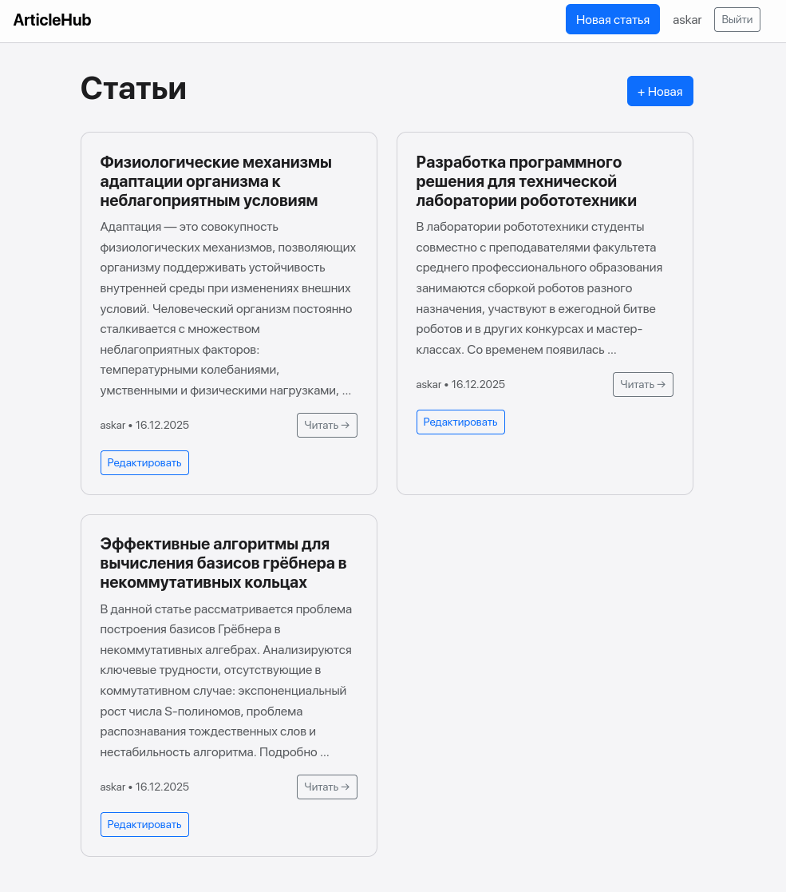

# ArticleHub

Минималистичная платформа для публикации статей



## Технологии

- **Python** - бэкенд язык
- **Django** - веб-фреймворк
- **Django Allauth** - аутентификация
- **Bootstrap 5** - css фреймворк
- **Crispy Forms** - рендеринг форм
- **SQLite** - база данных по умолчанию

## Установка

1. Клонируйте репозиторий
```bash
git clone https://github.com/acakp/articlehub.git
cd articlehub
```

2. Создайте виртуальное окружение
```bash
python -m venv venv
```

3. Активируйте виртуальное окружение
- *Windows*:
```bash
venv\Scripts\activate
```
- *macOS/Linux*:
```bash
source venv/bin/activate
```

4. Установите зависимости
```bash
pip install -r requirements.txt
```

5. Выполните миграции
```bash
python manage.py migrate
```

7. Запустите сервер
```bash
python manage.py runserver
```

8. Откройте в браузере
```
http://127.0.0.1:8000/articles
```
